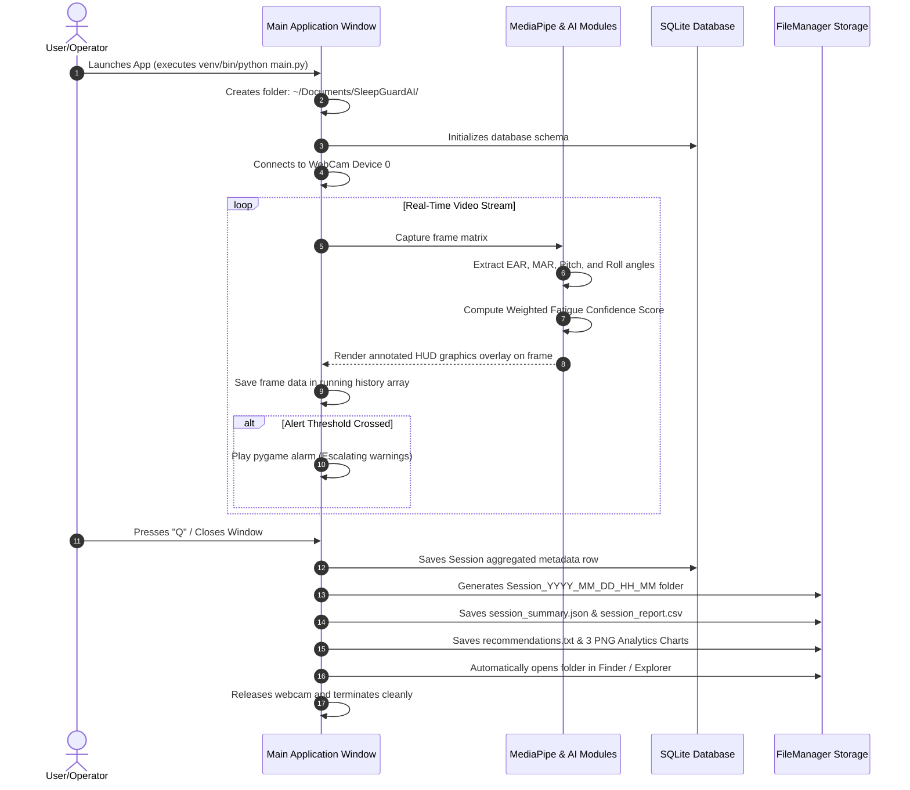

# 🧠 NeuroGuard AI: AI-Powered Real-Time Fatigue Monitoring & Behavioral Analytics System

[](https://www.python.org/)
[](https://opencv.org/)
[](https://mediapipe.dev/)
[](https://www.sqlite.org/)
[](LICENSE)

NeuroGuard AI is an enterprise-grade, real-time computer vision and behavioral analytics pipeline designed to monitor operator fatigue, optimize workplace safety, and prevent fatigue-induced accidents. By utilizing high-frequency facial landmark tracking, multi-signal confidence engines, and state-machine alert escalation, NeuroGuard AI accurately tracks driver drowsiness, yawning frequency, and micro-sleep markers, automatically generating detailed analytical session dashboards and localized safety insights reports.

---

## 📋 Table of Contents
1. [Project Overview](#-project-overview)
2. [Key Features](#-key-features)
3. [AI & Computer Vision Features](#-ai--computer-vision-features)
4. [Tech Stack](#-tech-stack)
5. [System Architecture](#-system-architecture)
6. [Project Workflow](#-project-workflow)
7. [Folder Structure](#-folder-structure)
8. [Installation Guide](#-installation-guide)
9. [How to Run](#-how-to-run)
10. [Detection Pipeline Deep Dive](#-detection-pipeline-deep-dive)
11. [Fatigue Confidence Scoring Engine](#-fatigue-confidence-scoring-engine)
12. [Intelligent Alert Management System](#-intelligent-alert-management-system)
13. [Analytics, Reports & Insights System](#-analytics-reports--insights-system)
14. [Challenges Faced & Key Learnings](#-challenges-faced--key-learnings)
15. [Standalone Application Deployment](#-standalone-application-deployment)
16. [Screenshots & Demo Placeholders](#-screenshots--demo-placeholders)
17. [Future Enhancements](#-future-enhancements)
18. [License & Contact](#-license--contact)

---

## 🔍 Project Overview

In high-stakes industries such as long-haul transport, manufacturing, and software operations, operator fatigue is a primary cause of critical safety incidents. Standard rule-based single-sensor systems suffer from high false-alarm rates and latency. 

**NeuroGuard AI** addresses this limitation by deploying a unified multi-condition sensor fusion framework that processes real-time video streams to calculate:
- Eye Aspect Ratio (EAR) for micro-sleep warning detection.
- Mouth Aspect Ratio (MAR) to evaluate fatigue yawning markers.
- Head Pose Estimation (Pitch/Roll Euler angles) to catch nodding-off patterns.
- An Escalating Fatigue Confidence Engine that combines these inputs into a single confidence index.
- An Intelligent Alert Manager that implements sound warnings and automatic report compilations.

---

## ✨ Key Features

- **Real-Time Video Pipeline**: High-performance frame acquisition and rendering overlay utilizing vanilla OpenCV.
- **Sub-millimeter Landmark Tracking**: Face-mesh modeling via MediaPipe.
- **Centralized Configurations**: Centralized project parameters (thresholds, weights, folders) stored in `config/settings.py`.
- **Dual Console-File Logging**: Custom runtime logger writing console signals and persistent logs to `~/Documents/SleepGuardAI/sleepguard.log`.
- **Database Telemetry Logging**: Automatically creates and writes session metadata to a local SQLite database for historical logging.
- **Timestamped File Management**: Saves session reports dynamically to `~/Documents/SleepGuardAI/Sessions/Session_YYYY_MM_DD_HH_MM/`.
- **Automatic Report Launcher**: Opens macOS Finder or OS File Explorer automatically showing report sheets on exit.

---

## 🤖 AI & Computer Vision Features

- **MediaPipe Landmark Extraction**: Tracks $468$ 3D face mesh coordinates at sub-pixel resolution.
- **PnP Solver Pose Estimator**: Solves the Perspective-n-Point (PnP) problem mapping 2D camera coordinates to 3D facial models to obtain Pitch and Roll angles.
- **Sensor Fusion Logic**: Weights behavioral markers dynamically (Eyes: 50%, Head Tilt: 30%, Yawn: 20%) to avoid false alarms from isolated blinks.
- **Intelligent Insight Classifier**: A rules-based decision classifier that grades session fatigue severity (`LOW`, `MEDIUM`, `HIGH`) and generates verbal driver rest instructions.

---

## 🛠️ Tech Stack

| Domain | Technology | Description |
|---|---|---|
| **Language** | Python 3.11 | High-level language interface |
| **Vision** | OpenCV (cv2) | Frame capture, matrix manipulation, HUD graphics |
| **Mesh Tracking** | MediaPipe | Face Mesh modeling and landmarks extraction |
| **Math & Matrix** | NumPy & SciPy | Multi-dimensional matrix math, coordinate geometry |
| **Audio Alert** | Pygame Mixer | Thread-safe, non-blocking warning sound generation |
| **Database** | SQLite3 | Local storage of historical metrics |
| **Visualizing** | Matplotlib | Timeline graphs and multi-panel charts |
| **Packaging** | PyInstaller | Executable bundling and packaging |

---

## 🏗️ System Architecture

```
                                +-------------------+
                                |   Webcam Stream   |
                                +-------------------+
                                          |
                                          v
                                +-------------------+
                                |    OpenCV (cv2)   |
                                +-------------------+
                                          |
                                          v
                                +-------------------+
                                | MediaPipe Mesh    |
                                +-------------------+
                                          |
                   +----------------------+----------------------+
                   |                      |                      |
                   v                      v                      v
         +-------------------+  +-------------------+  +-------------------+
         | Eye Tracking (EAR)|  | Yawn Tracking(MAR)|  | Head Pose Euler   |
         +-------------------+  +-------------------+  +-------------------+
                   |                      |                      |
                   +----------------------+----------------------+
                                          |
                                          v
                                +-------------------+
                                | Fatigue Engine    |
                                +-------------------+
                                          |
                                          v
                                +-------------------+
                                |   Alert Manager   |
                                +-------------------+
                                          |
                                          v
                                +-------------------+
                                |  SQLite Database  |
                                +-------------------+
                                          |
                                          v
                                +-------------------+
                                |  Reports Engine   |
                                +-------------------+
```

---

## 🔄 Project Workflow



---

## 📁 Folder Structure

```
NeuroGuard-AI/
│
├── analytics/
│   ├── charts.py            # Historical session reports dashboard chart generator
│   ├── dashboard.py         # Current session multi-panel dashboard generator (PNGs)
│   ├── insight_engine.py    # Fatigue severity and safety recommendations classifier
│   └── report_generator.py  # Exports CSV timelines, JSON records, and TXT recommendations
│
├── assets/
│   └── alarm.wav            # Warning sound file used by alert manager
│
├── config/
│   └── settings.py          # Centralized configuration thresholds and system paths
│
├── deployment/
│   └── build_app.py         # PyInstaller package compilation script
│
├── modules/
│   ├── alarm.py             # Pygame sound controls and thread safety manager
│   ├── alert_manager.py     # State-machine cooldown and warning escalation controller
│   ├── database.py          # SQLite database schema initializer and save/query queries
│   ├── ear.py               # Eye Aspect Ratio calculation math
│   ├── eye_tracker.py       # Extracts pixel landmark matrices for eyes
│   ├── face_mesh.py         # MediaPipe FaceMesh wrapper initialization
│   ├── fatigue_engine.py    # Computes weighted fatigue scoring index
│   ├── head_pose.py         # Estimator solving PnP model for Pitch/Roll angles
│   └── yawn_detector.py     # MAR tracker and yawning events counter
│
├── reports/                 # Backup local reports output folder
│
├── utils/
│   ├── file_manager.py      # Output path resolver and auto-opening folders controller
│   └── logger.py            # Console and file logger module
│
├── main.py                  # Core application video execution loop entrypoint
├── requirements.txt         # Project package requirements list
└── README.md                # System documentation
```

---

## 💻 Installation Guide

Follow these steps to configure the system locally:

### 1. Clone Repository
```bash
git clone https://github.com/vaishnavi24-hyd/VigilAI.git
cd VigilAI
```

### 2. Configure Virtual Environment
We recommend using Python 3.11. Create a clean virtual environment to isolate project packages:
```bash
python3.11 -m venv venv
```

### 3. Activate Environment
- **macOS / Linux**:
  ```bash
  source venv/bin/python3
  ```
- **Windows**:
  ```cmd
  venv\Scripts\activate
  ```

### 4. Install Dependencies
```bash
pip install --upgrade pip
pip install -r requirements.txt
```

---

## 🚀 How to Run

Launch the application loop directly from the terminal:
```bash
python main.py
```

### Window Commands:
- Press **`q`** to close the session cleanly, export reports, and open the Finder output folder.
- Click the **`X`** on the window title bar to terminate the session and trigger report generation.

---

## ⚙️ Detection Pipeline Deep Dive

The system performs analysis across three primary facial features:

### 1. Eye Aspect Ratio (EAR)
The EAR formula maps 6 facial landmarks surrounding the eye. By measuring the ratio of vertical distances to the horizontal distance, it determines blink events and prolonged closure periods:

$$EAR = \frac{||p_2 - p_6|| + ||p_3 - p_5||}{2 \cdot ||p_1 - p_4||}$$

| Coordinate Points | Description |
|---|---|
| $p_1, p_4$ | Horizontal eye corners |
| $p_2, p_3, p_5, p_6$ | Vertical eye borders |

### 2. Mouth Aspect Ratio (MAR)
Monitors yawning triggers by evaluating lip aperture ratios:

$$MAR = \frac{||m_2 - m_8|| + ||m_3 - m_7|| + ||m_4 - m_6||}{2 \cdot ||m_1 - m_5||}$$

### 3. Head Pose Estimation
Obtains user pose by mapping 2D face mesh points to a standard 3D generic facial coordinate model (`solvePnP`). The resulting rotation matrix is decomposed to retrieve Pitch (head nodding down) and Roll (head tilting sideways) angles.

---

## 🎛️ Fatigue Confidence Scoring Engine

To prevent false alarms caused by random isolated gestures (e.g., a simple long blink or a quick yawn), the **Fatigue Confidence Engine** processes state frame counters through a weighted evaluation matrix.

$$Fatigue\ Score\ (\%) = (S_{eye} \cdot w_{eye}) + (S_{tilt} \cdot w_{tilt}) + (S_{yawn} \cdot w_{yawn})$$

Where:
- $S_{eye}$: Ratio of current eyes closed frames to EAR threshold limit.
- $S_{tilt}$: Ratio of current head tilted frames to tilt limit.
- $S_{yawn}$: Ratio of current yawning frames to MAR limit.
- weights ($w$): Configured at **50% Eyes**, **30% Head Tilt**, and **20% Yawning** by default.

---

## 🚨 Intelligent Alert Management System

The alert manager implements a robust state machine with cooldown timers to avoid spamming the driver with repetitive sound triggers:

```
                  +--------------+
                  |   INACTIVE   |
                  +--------------+
                         |
                 Fatigue score >= 20%
                         |
                         v
                  +--------------+
                  |    ACTIVE    |<--------------------+
                  +--------------+                     |
                         |                             |
                 Fatigue score < 20%             High Fatigue
                         |                            or
                         v                        Cooldown Expired
                  +--------------+                     |
                  |   COOLDOWN   |---------------------+
                  +--------------+
```

- **LOW Severity (<20%)**: Safe boundaries. Screen overlay is green. Alarms remain inactive.
- **MEDIUM Severity (20% - 40%)**: Warning triggers a short, temporary beep (1.5 seconds) and enters a 5-second **COOLDOWN** period during which repeated medium alarms are silenced.
- **HIGH Severity ($\ge$ 40%)**: Critical danger. Overrides cooldown limits to sound the pygame alarm continuously until the driver recovers.

---

## 📊 Analytics, Reports & Insights System

On shutdown, NeuroGuard AI saves your session outputs to `~/Documents/SleepGuardAI/Sessions/Session_YYYY_MM_DD_HH_MM/`.

```
~/Documents/SleepGuardAI/Sessions/Session_2026_05_20_09_54/
├── session_report.csv          # Raw frame timeline (Seconds, Fatigue, Eyes Closed, Yawning, Tilted)
├── session_summary.json        # Session metrics summary with embedded insights JSON
├── recommendations.txt         # Formatted safety suggestions report
├── fatigue_trend.png           # Line chart plotting fatigue % over time
├── drowsiness_chart.png        # Warning timelines step plot (Eyes closed, Yawning, Head Pose)
└── dashboard_summary.png       # Combined panels (Key Stats, Bar Chart, Exposure Pie Chart)
```

### Sample Safety Recommendations Output:
```
SleepGuard AI Fatigue & Rest Recommendations Report
==================================================
Session Date: 2026-05-20 11:00:00
Session Duration: 500.0 seconds
Fatigue Severity Classification: HIGH

Fatigue Summary:
High fatigue detected during this 500-second session. You experienced critical drowsiness indicators, peaking at 75.0% fatigue. Alert warnings triggered 8 times, presenting a serious hazard of micro-sleeps.

Actionable Recommendations:
- CRITICAL: Pull over safely immediately and take a 20-minute power nap.
- Avoid continuing to drive or perform focus-intensive tasks in this state.
- Rest your eyes to recover from screen/road glare and reduce eye fatigue.
- Increase cabin airflow: Open windows or turn on the air conditioner to replenish oxygen levels.
```

---

## 🛠️ Challenges Faced & Key Learnings

### 1. SDL Library Conflicts on macOS
- **Challenge**: Both OpenCV (cv2) and Pygame load independent versions of the Simple DirectMedia Layer (SDL) on macOS, resulting in thread locking, warnings, and app termination during concurrent execution.
- **Resolution**: Segregated pygame sound loading into a dedicated backend class, initialised pygame audio mixer only when playing alerts, and implemented a clean shutdown callback method to release sound card locks safely.

### 2. High False-Alarm Rates
- **Challenge**: Drivers frequently check mirrors or glances sideways, which simple threshold checks classify as drowsiness.
- **Resolution**: Developed the weighted fatigue score sensor fusion engine to ignore isolated occurrences and trigger alerts only on sustained patterns.

---

## 📦 Standalone Application Deployment

To bundle the application into a single executable wrapper for distribution (useful for macOS packaging):

### 1. Compile Executable
Run the custom pyinstaller wrapper script:
```bash
python deployment/build_app.py
```
This creates a standalone binary wrapper under `dist/NeuroGuardAI`.

---

## 🖼️ Screenshots & Demo Placeholders

### 1. Live Monitoring Interface
*Insert screenshot demonstrating the real-time OpenCV window rendering FaceMesh overlays and HUD stats.*

### 2. Session Summary Dashboard Chart
*Insert generated reports/dashboard_summary.png showing key metrics table, event counts, and exposure slices.*

---

## 🚀 Future Enhancements

- **Infrared Camera Support**: Integrate near-infrared (NIR) camera processing to support night-driving conditions.
- **Biometric Wearable Syncing**: Connect heart rate variability (HRV) metrics from smartwatches to combine physiological markers with visual tracking.
- **Mobile Companion Application**: Build a lightweight iOS/Android dashboard companion app.

---

## 📄 License

This project is licensed under the MIT License. See the [LICENSE](LICENSE) file for details.

---

## ✍️ Author
- **Developer**: Vaishnavi Guttapally
- **Corpus Name**: vaishnavi24-hyd/VigilAI
- **GitHub**: [https://github.com/vaishnavi24-hyd/VigilAI.git](https://github.com/vaishnavi24-hyd/VigilAI.git)
